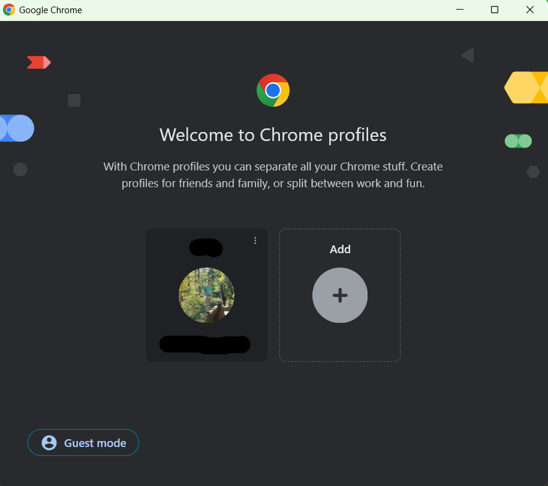
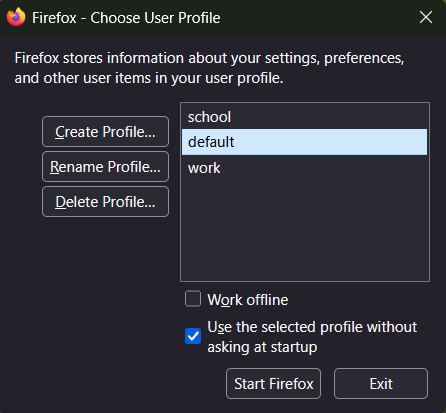

# Firefox Profile Manager
## By Ivan Gavrushenko
## March 14, 2025

I recently switched from Chrome to Firefox, as my main browser. In Chrome, I used to separate my browser windows into several profiles (personal, work, etc). In Chrome, profiles are a nice way to separate history, bookmarks, saved tabs and all other browsing information into, well, different profiles.

When I switched to using Firefox though, I realized the lack of well made profile manager. In fact, it almost seems like profiles are an afterthought in Firefox. To access the profile manager, you need to run the `firefox.exe -P` command (in the prompt after pressing `Windows+R`), or go to `about:profiles` in the browser itself.

Profile manager in Chrome:

Profile manager in Firefox:

As it's clearly visible, the Firefox way to open a profile manager is more **inefficient** - takes more time than needed, and the look of it in Firefox is much less **visually appealing** - looks good, compared to Chrome.

Unlike Chrome, there is also no way to automatically make a desktop shortcut to a Firefox profile. After looking in the online Firefox documentation, it turns out that a desktop shortcut to `firefox.exe -P profile_name` can open that profile from the desktop. The Firefox UI (user interface) does not have a way to do that automatically, but it can be set up manually. "Problem solved", I thought, and proceeded to set up and use my newly created profiles.

In a few hours, I opened a browser link from a different application. It opened the link in the "default" Firefox profile. The problem was, the "default" profile was not my last opened profile. I soon realized that no matter what I did, any external link would be opened in the "default" Firefox profile. That **conceptual model** (the way it actually worked) did not match my **mental model** of how profiles should work. In Chrome, the last active profile was the one where the link would be opened instead.

**Recovering from the error** is easy enough - close the newly opened tab in the wrong profile. The only solution to the problem - links opening in the wrong profile - is to manually copy the link and to manually paste it in browser. While that is **effective** and gets the job done, it's quite **inefficient**, since it takes too much time and thinking to manually copy every link, instead of just clicking it. A solution to this problem would be to save the last active profile, and open any links in that profile, instead of the "default" one. I would also propose making the creation of profile desktop shortcuts more integrated into the UI of the Firefox profile manager. Moreover, the profile manager should be more accessible.
